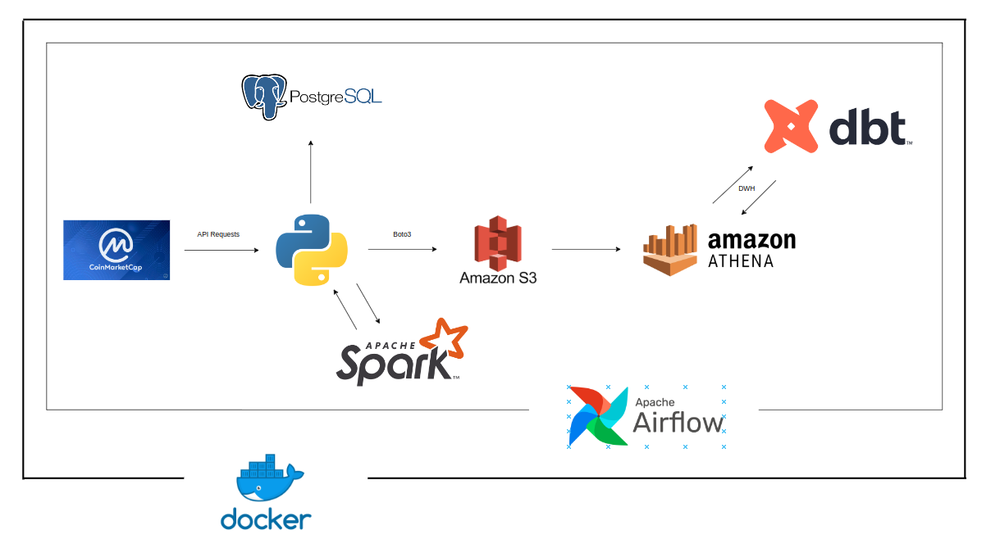
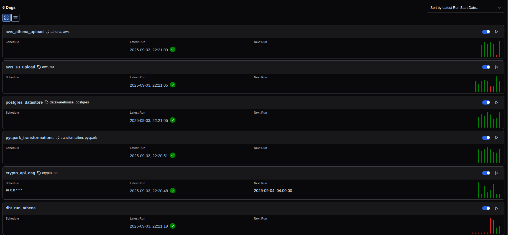
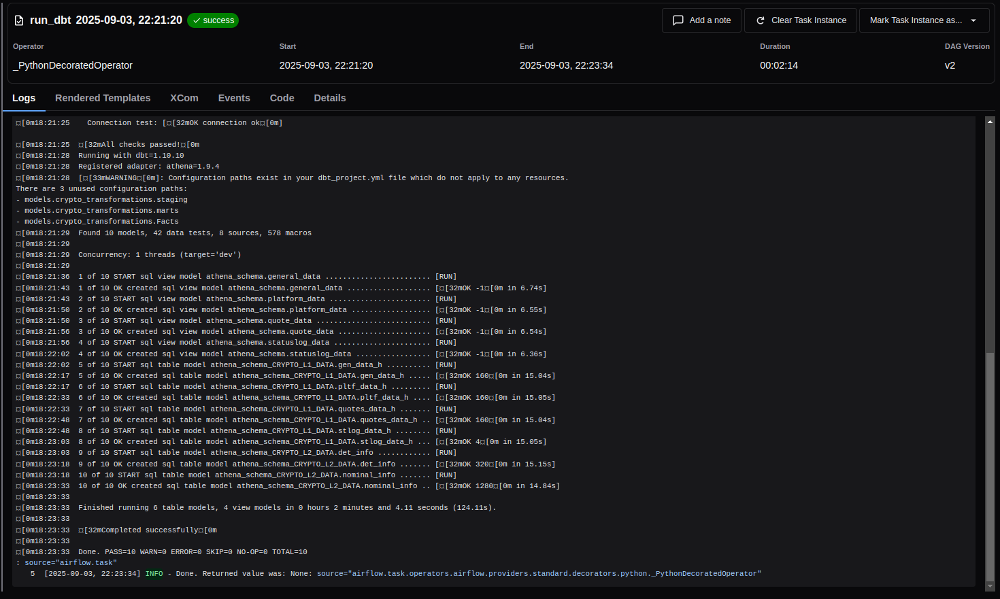
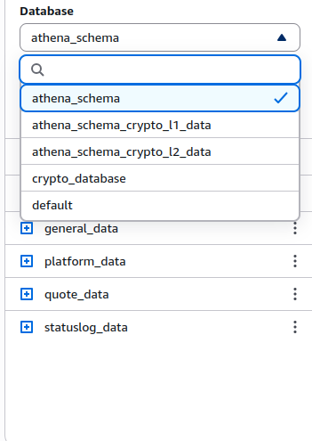
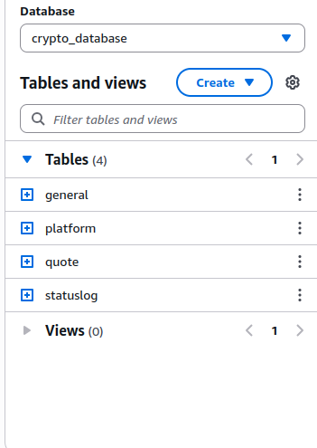
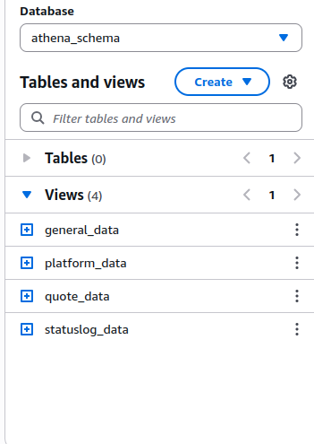
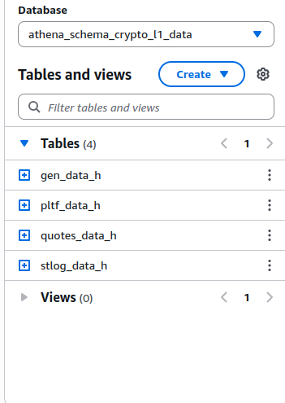
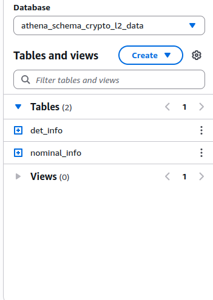

# ETL-Data-Pipeline

### ETL Pipeline

#### Overview
This project is a fully automated ETL (Extract, Transform, Load) pipeline designed to extract data from an API, processing it using PySpark, and store it in PostgreSQL and AWS ATHENA. It mainly supports batch processing using Spark. In Athena Data has DWH Format made using dbt, The entire system is containerized using Docker and managed via Docker Compose.

#### Data Source
The project uses data source provided by Coinmarketcap's API. For simplicity, the project uses:
#### https://pro-api.coinmarketcap.com/v1/cryptocurrency/listings/latest

### Key Features
#### 1. Data Extraction
* Uses a requests to fetch the json format of the API.
* Ensures data consistency before loading into the next stage.
#### 2. Workflow Orchestration with Apache Airflow
* Automates data extraction, transformation, and loading.
* Automates data uploading in Cloud (AWS S3) and then transfer data to AWS Athena.
* Automates data auploading to PostgeSQL.
* Automates DWH formating using dbt.
#### 3. Data Storage and Processing
* PostgreSQL acts as the intermediate storage layer.
* AWS Athena is used for scalable data analytics and Data Warehousing.
#### 4. Batch Processing using PySpark, and Python packages (Boto3)
* Uses PySpark to process data and upload it in postges.
* Data uploading to AWS S3 using Boto3 library.
#### 5. Data Transformation using DBT
* Data uploaded in AWS athena wanted to be in DWH format, for that one of the best option that I chose s dbt.
* Automates Data Processing in Staging, Facts and Marts format.
#### 6. Containerized Deployment
* Uses Docker Compose to manage PostgreSQL, Spark, and Airflow.
* Each service runs in its own isolated container.

### Flow Architecture:
















### Prerequisites:
* Docker & Docker Compose
* Python
* Apache Airflow
* PostgreSQL
* dbt-athena
* Apache Spark
* AWS Permissions & Credentials

### Setup Instructions:
1) Clone the Repository
   * ```git clone https://github.com/Giko20/DataTalks-Data-Engineering-Project.git/```
   * ```cd DataTalks-Data_Engineering-Project```
2) Set Up Environment Variables
   Create a ```.env``` file in the project directory and configure it with your details:
   ```
      POSTGRES_DB = <your postgres database name>
      POSTGRES_USER = <your postgres user>
      POSTGRES_PASSWORD = <your postgres password>
      API_KEY = <your API_KEY>
      url="https://pro-api.coinmarketcap.com/v1/cryptocurrency/listings/latest"
      access_key = <your public access key>
      secret_access_key = <your secret access key>
      aws_s3_bucket_name = <your bucket name>
      aws_region = <your region name>
      athena_database = <your database name>
   ```
3) Start the Docker Containers
   ```
   docker-compose up -d --build
   ```
   this command will start all services.


## After that watch and enjoy 💯

